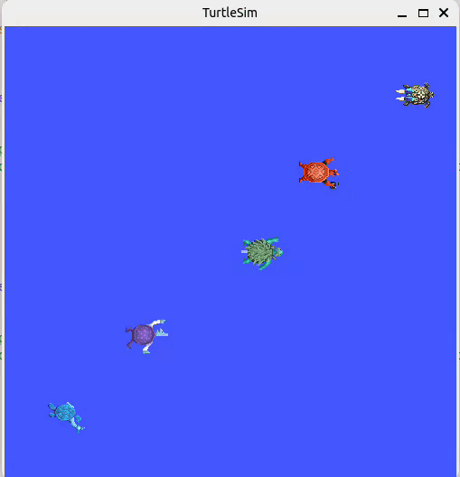

# Module _2 Assignment Submission

## Overview
This project demonstrates advanced ROS 2 programming techniques through a series of tasks involving Turtlesim and Turtlebot3 simulations. The assignment focuses on creating custom ROS 2 nodes, utilizing launch files, and implementing dynamic robot control strategies.

## Project Structure

```
module_2_assignment/
│
├── src/
│   ├── task1_drive_turtle.cpp          # Circular and Logarithmic Motion 
│   ├── task3_driver.cpp                # Back and Forth Turtle Driver
│   ├── task4_driver.cpp                # Parametric Turtle Speed Control
│   └── multi_turtlebot3_controller.cpp # Multi-Robot Controller
│
├── launch/
│   ├── task2_turtle_bot_drive.launch.py        # Task 2 Launch File
│   ├── task3_assignment.launch.py              # Task 3 Turtlesim Launch File
│   ├── task4_assignment.launch.py              # Task 4 Parametric Launch File
│   ├── multi_turtle_bot_entity.launch.py       # Turtlebot3 Spawning Launch File
│   └── multi_turtlebot_service_call.launch.py  # Alternative Turtlebot3 File 
│
└── README.md
```

## Tasks Implemented

## Task 1: Custom ROS 2 Node - Motion Patterns
Implemented two motion types:
- **Circular Motion**: Turtle moves in a perfect circle.
- **Logarithmic Spiral Motion**: Turtle follows a logarithmic spiral path.

Configurable parameters:
- Motion type
- Radius/Scaling factor
- Linear velocity

## Task 2: Launch File Configuration
Created a launch file to simultaneously start:
- Turtlesim simulation
- Custom ROS 2 node

Supports dynamic parameter configuration.

## Task 3: Multi-Turtle Simulation
- Spawned 5 turtles diagonally in Turtlesim.
- Implemented back-and-forth movement for middle turtles.
- Used ROS 2 services for turtle spawning and simulation control.

## Task 4: Dynamic Parameter Control
Added ROS 2 parameters to dynamically modify:
- Linear speed
- Angular speed

Real-time parameter updates during simulation.

## Dependencies
- ROS 2 Humble
- Turtlesim
- Turtlebot3 Packages

## Installation
Clone the repository and build the workspace:
```bash
cd assignment_ws
colcon build --packages-select module_2_assignment
source install/setup.bash
```

## Running the Simulations

### Task 1: Motion Patterns
```bash
# Circular Motion
ros2 launch module_2_assignment task2_turtle_bot_drive.launch.py motion_type:=circular b:=2.0

# Logarithmic Spiral Motion
ros2 launch module_2_assignment task2_turtle_bot_drive.launch.py motion_type:=logarithmic b:=0.5
```

### Task 3: Multi-Turtle Simulation
```bash
ros2 launch module_2_assignment task3_assignment.launch.py
```

### Task 4: Dynamic Parameter Control
```bash
ros2 launch module_2_assignment task4_assignment.launch.py

# Dynamically change parameters
ros2 param set /turtle_driver3 linear_speed 2.0
ros2 param set /turtle_driver5 angular_speed 1.5
```

## Demonstration

<p align="center">
  
</p>


## Challenges and Learning Outcomes
- ROS 2 node creation
- Launch file configuration
- Dynamic parameter management
- Multi-robot simulation techniques

## Future Improvements
- Will add custom service call for spawning multiple turtlebots

## Author
Meraj Hossain Promit