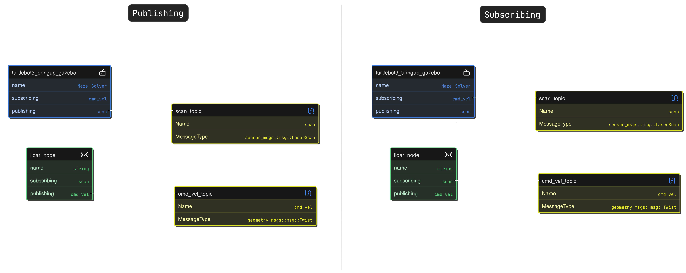
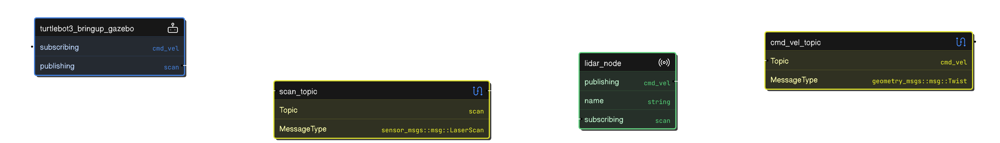
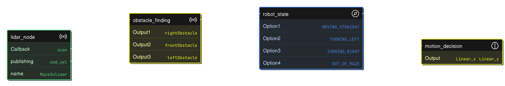

## Task 1: Restructure Line Following Project Code

Refactored the existing line-following project code to improve its structure and readability based on the principles discussed in the lectures. The following changes were made:

- Used **PascalCase** for class names.
- Applied **camelCase** for function names and local variables.
- Used **_camelCase** for class variables.
- Adopted **SNAKE_CASE** for constants.
- Followed **snake_case** for file names.
- Improved parameterization using ROS 2 parameters for tunable values.
- Enhanced code modularity and readability while maintaining functionality.


## Task 2: Design Software Flow for Maze Solving

### Software Flow Diagrams

### 1. Publishing and Subscribing Overview


This diagram showcases the interaction between the `turtlebot3_bringup_gazebo` node and the `lidar_node`. The topics used include:
- `scan` (published by `turtlebot3_bringup_gazebo` and subscribed by `lidar_node`).
- `cmd_vel` (published by `lidar_node` and subscribed by `turtlebot3_bringup_gazebo`).

### 2. System Node Interconnections


This diagram demonstrates how the `scan_topic` and `cmd_vel_topic` connect with the nodes in the system. The flow shows how sensor data and velocity commands are passed within the system.

### 3. Decision-Making Process


This final diagram represents the logic for obstacle detection and decision-making. The `lidar_node` uses data from the `scan` topic to identify obstacles and update the `robot_state`. The decision-making logic determines the robot's movement commands (`Linear_x` and `Linear_y`) based on the detected state.

## Implementation
These diagrams guide the implementation of a ROS2-based system for maze-solving. Each node and topic is defined according to the requirements for navigation, obstacle detection, and movement control.

---


### Task 3: Maze Solving Implementation
- Created a square-shaped maze in Gazebo
- Implemented right-wall following algorithm
- Utilized LIDAR sensor for obstacle detection
- Used IMU sensor to calculate velocity and acceleration

## Demo


## Launch Instructions


To visualize it in ROS 2, follow these steps:

1. **Build the Workspace:**
   ```bash
   cd ~/assignment_ws
   colcon build
   ```

2. **Running the Code**


   **Source the Workspace & launch the launch file :3**
   ```bash
   source install/setup.bash

   ros2 launch module_4_assignment task_3_wall_follwing.launch.py
   ```

## Task 4: Debugging Robot Sensing Launch Files

### Objective
Fixing errors in the `robot_sensing_debug` package launch files and document the debugging process.

### Errors and Solutions

### Error 1: Incorrect Package Name
#### Original Code
```
Original Code
maze_solver = Node(
   package = 'robot_sensing', 
   name = 'maze_solvers', 
   executable ='mazeSolving'
)
```
```
Fixed Code
pythonCopymaze_solver = Node(
    package = 'robot_sensing_debug', 
    name = 'maze_solver', 
    executable ='mazeSolving'
)
```

### Error 2: Incorrect World File Path
```
Original Code
pythonCopyworld = os.path.join(
    get_package_share_directory('robot_sensing'), 
    'worlds', 
    'mazes.world'
)
```

```
Fixed Code
pythonCopyworld = os.path.join(
    get_package_share_directory('robot_sensing_debug'), 
    'worlds', 
    'maze.world'
)
```
### Error 3: Unsupported CMake Version
```
Original Code
cmakeCopycmake_minimum_required(VERSION 3.8)
```
```
Fixed Code
cmakeCopycmake_minimum_required(VERSION 3.10)
```

### Summary of Fixes

- Updated package name from robot_sensing to robot_sensing_debug
- Corrected world file path and name
- Renamed node from maze_solvers to maze_solver
- Updated minimum CMake version from 3.8 to 3.10

### Key Debugging Steps

- Verifying package naming consistency
- Checking file paths and names
- Ensuring CMake compatibility
- Testing launch file after modifications


